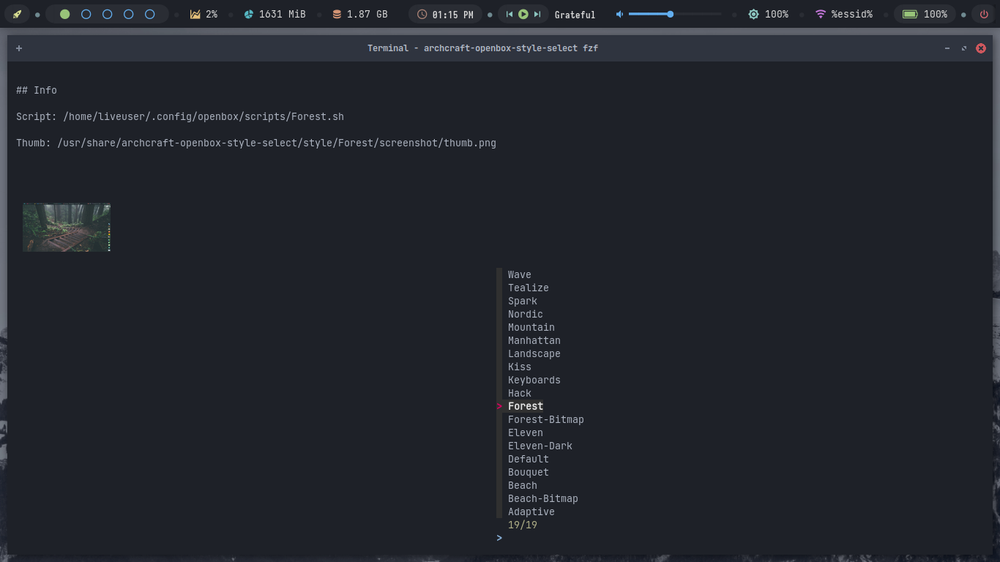

# archcraft-openbox-style-select


## Subject

* [Introduction](#introduction)
* [Install](#install)
* [Usage](#usage)
* [Reference](#reference)


## Introduction

* [`archcraft-openbox-style-select`](files/archcraft-openbox-style-select) is a command line tool.
* integrate to call [archcraft-openbox/scripts](https://github.com/archcraft-os/archcraft-openbox/tree/main/files/scripts).
* to change archcraft openbox style.
* to show style list by fzf.
* with preview [screenshot thumbnail](https://github.com/samwhelp/archcraft-openbox-style-select/tree/main/files/share/style).

## Usage

## fzf

```
archcraft-openbox-style-select fzf
```




## Install

### Clone

``` sh
git clone https://github.com/samwhelp/archcraft-openbox-style-select.git
```

### Cd Work Dir

``` sh
cd archcraft-openbox-style-select
```

### Prepare Build Essential

run to install [base-devel](https://archlinux.org/groups/x86_64/base-devel/)

``` sh
make preare
```

### Build Package

run to build package

``` sh
make build
```

or run

``` sh
./build.sh
```

### Install Package


run to install package

``` sh
make install
```

or run

``` sh
make reinstall
```

### List Package Files

run to show package files

``` sh
make list
```

### Uninstall

run to uninstall package

``` sh
make uninstall
```

### Clean

run to clean some file after build

``` sh
make clean
```


## Reference

* https://wiki.archlinux.org/title/Arch_User_Repository
* https://archlinux.org/groups/x86_64/base-devel/
* https://wiki.archlinux.org/title/pacman
* https://wiki.archlinux.org/title/PKGBUILD


## Reference / Fzf Preview Image

* https://github.com/pystardust/ytfzf/blob/master/ytfzf
* https://github.com/OliverLew/fontpreview-ueberzug/blob/master/fontpreview-ueberzug
* https://github.com/samwhelp/note-about-fzf/tree/gh-pages/_demo/start/preview/image_by_ueberzug


## Link

* https://github.com/samwhelp/note-about-fzf
* https://archcraft.io/
* https://github.com/archcraft-os
* https://github.com/archcraft-os/archcraft/issues/200
